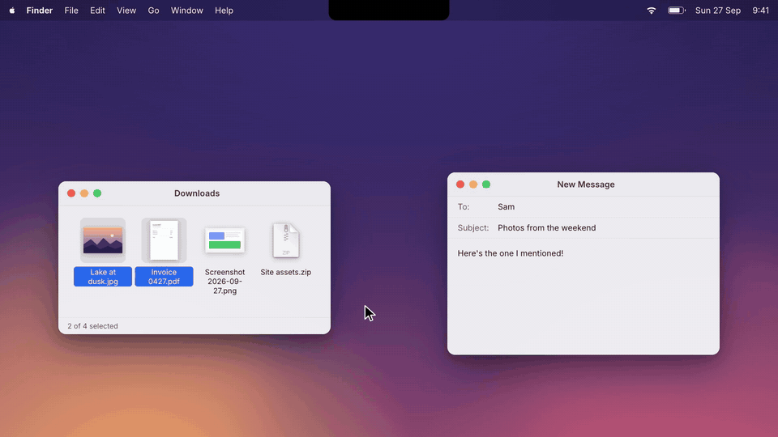
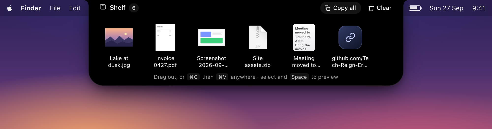
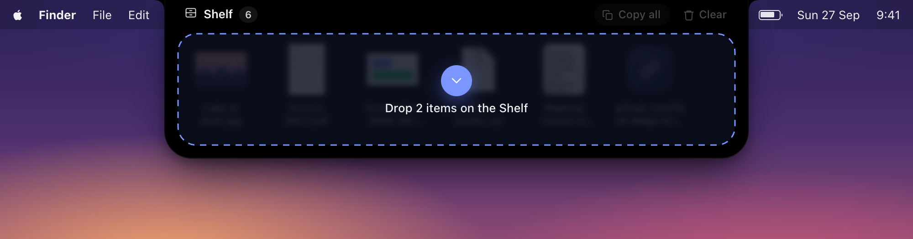
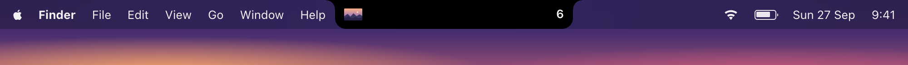
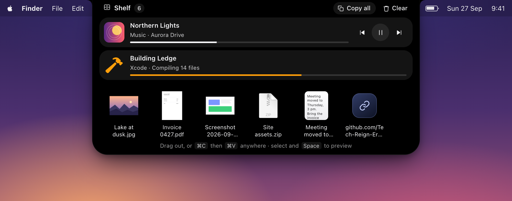
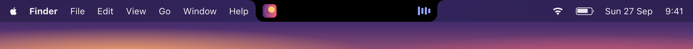
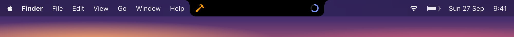
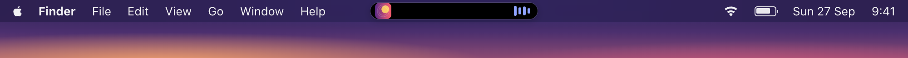

# Ledge

A Shelf in your Mac's notch. Keep files, text and links there for a moment, then drop them where they need to go.

**[tech-reign-era-services.github.io/ledge](https://tech-reign-era-services.github.io/ledge/)**



<sub>20 seconds, no sound. [Watch it in full quality (MP4)](docs/demo.mp4).</sub>

- **Hover** over the notch to peek, **drag** anything toward it to drop it in, or press **⌃⌥S** to open it.
- Drag items out to Finder, Mail, Slack or a browser upload box. Or select them, press **⌘C**, and **⌘V** anywhere.
- **Space** opens Quick Look, just like in Finder. **⌘V** in the Shelf adds whatever is on the clipboard.
- Files are kept by reference: never copied, never moved. On a Mac without a notch, the Shelf sits in the middle of the menu bar.



Drag something toward the notch and the Shelf opens to take it. Closed, it shows the newest item and how many there are:




**Live activities**, like the Dynamic Island on iPhone:

- **Music:** while Apple Music or Spotify plays, the island shows the album artwork and bars that move to the music itself: bass to treble, from the player's own audio (macOS 14.2 or later; macOS asks once for System Audio Recording, and nothing is recorded or saved). Hover over the island for the song, a progress bar, and play, pause and skip.
- **Other apps** can show what they're doing, like a build, an upload or a timer, with a title, a symbol or emoji, progress, and a few characters beside the island. See [Show your app in the island](#show-your-app-in-the-island).
- **Settings…** in the menu bar icon (or ⌘,, or `open ledge://settings`): make the pill wider, taller or lower, the open island wider, open on hover or only on a click, and choose the music bars' colour. Changes show on the pill as you make them.
- **No notch? No problem.** On an external display, or any Mac without a notch, the island is a floating pill in the middle of the menu bar that appears when something is live or on the Shelf, and grows out of itself when you hover.



Closed, the island shows what's live beside the notch: the album artwork and bars that move to the music, or an app's symbol and its progress. Without a notch, the same thing sits in a pill:





The Shelf used to be part of [Inlet](https://github.com/Tech-Reign-Era-Services/inlet). The first time Ledge runs, it brings over anything that was on Inlet's Shelf.

## Download

Get **`Ledge-<version>.pkg`** (or the `.zip`) from [**Releases**](https://github.com/Tech-Reign-Era-Services/ledge/releases/latest). One download for every Mac, Apple silicon and Intel alike, under 1 MB. Needs macOS 13 Ventura or later.

The first time, macOS may say it can't verify it: Ledge isn't signed with a paid Apple certificate. **Right-click** it → **Open** → **Open**.

## Show your app in the island

Any app or script can start, update and end a live activity. There's no SDK: open a URL, or post a notification.

```sh
# Start (or update) an activity. Only id and title are needed to start one.
open -g "ledge://activity?id=build&title=Building&subtitle=Compiling%2014%20files&symbol=hammer.fill&progress=0.4&source=Xcode"

# Update it: only what changed.
open -g "ledge://activity?id=build&progress=0.9"

# End it.
open -g "ledge://activity/end?id=build"
```

From Swift (or anything that can post a distributed notification), without opening a URL. The object is a JSON string,
because sandboxed apps can't send `userInfo`:

```swift
DistributedNotificationCenter.default().postNotificationName(
    .init("com.techreignera.ledge.activity"),
    object: #"{"id":"upload","title":"Uploading photos","symbol":"arrow.up.circle.fill","progress":0.3}"#,
    userInfo: nil, deliverImmediately: true)
// …and {"id":"upload","action":"end"} when it's done.
```

| Field | What it does |
|---|---|
| `id` | Required. Letters, digits, `.`, `_` and `-`. The same id updates the same activity. |
| `title` | Required to start. Up to 60 characters. |
| `subtitle` | A second line, up to 80 characters. |
| `source` | Who it's from, shown small (e.g. your app's name). |
| `symbol` | An [SF Symbol](https://developer.apple.com/sf-symbols/) name, e.g. `timer`. Or `emoji`: one emoji. Or `bundle`: an app's bundle id, to show its icon. |
| `progress` | 0 to 1. A ring beside the closed island, and a bar when it's open. |
| `trailing` | Up to 8 characters beside the closed island, e.g. `4:59` or `80%`. |
| `tint` | A colour like `#ff9f0a` for the symbol, ring and bar. |
| `link` | Opened when someone clicks the activity: a web page or your app's own URL scheme (never `file:`). |
| `ttl` | Seconds until it goes away by itself. Default 10 minutes, at most a day. |

Everything is treated as untrusted: text is shown as text, never as markup, and at most four app activities show at once.

## Why it's so small

Ledge is about 1.1 MB. Inlet's Electron build is 217 MB. The island is still the same HTML, CSS and JavaScript,
so the design and animations haven't changed, but it runs in the WebKit that ships with macOS instead of a bundled
Chromium. Everything else (the window over the notch, dragging, Quick Look, the clipboard, the shortcut) is a few
hundred lines of Swift, with no dependencies.

| | Inlet's Shelf (Electron) | Ledge |
|---|---|---|
| App size | 217 MB (the whole of Inlet) | 1.1 MB |
| Download | 217 MB `.pkg` | ~620 KB `.zip` or `.pkg` |
| Drag detection | a long-running `osascript` | a system mouse event, then a 50 ms check only while the button is down |

## Build

You need the Xcode Command Line Tools (`xcode-select --install`), not Xcode itself.

```sh
./build.sh          # dist/Ledge.app, universal (Apple silicon + Intel)
./build.sh run      # build and open it
./build.sh test     # run the tests
./build.sh dist     # also dist/Ledge-<version>.zip and .pkg, then checks the size budget
```

Requires macOS 13 or later.

## Layout

```
Sources/
  App.swift         menu bar item, shortcut, Open at Login, ledge:// URLs, moving over from Inlet
  Activities.swift  live activities: what's accepted from other apps, music, the list (no AppKit, tested)
  LiveActivities.swift  listening for music and other apps, player controls, icons
  Island.swift      the panel over the notch, its states and sizes, and the page's bridge
  Native.swift      drag detection, the global shortcut, thumbnails, clipboard, Quick Look
  Layout.swift      where the island sits for each state (no AppKit, tested)
  ShelfStore.swift  the items and shelf.json (no AppKit, tested)
web/                the island itself: shelf.html, shelf.css, shelf.js (from Inlet), bridge.js
tests/main.swift    tests for Layout, ShelfStore and Activities
scripts/            the icon, and the installer's pre/postinstall scripts
docs/               the demo video and screenshots in this README (not part of the app)
site/               the web page, published to GitHub Pages by .github/workflows/pages.yml
```

Items are saved in `~/Library/Application Support/Ledge/shelf.json`.

For development, `LEDGE_DATA_DIR=/tmp/ledge-dev` keeps a dev build's Shelf apart from your real one, `LEDGE_DEBUG=1` logs state changes, `LEDGE_NO_NOTCH=1` behaves as on a screen without a notch, and `LEDGE_SNAPSHOT=out.png LEDGE_STATE=open` draws the island
to a PNG and quits. See [CONTRIBUTING.md](CONTRIBUTING.md) to help out.

## Releasing (maintainers)

1. Bump `VERSION` and add an entry to the top of `CHANGELOG.md`.
2. Commit, then tag and push: `git tag v1.1.0 && git push origin v1.1.0`.
3. The **Release** GitHub Action runs the tests, builds the universal app, `.zip` and `.pkg`, checks the size budget, and
   attaches them to a draft release using `.github/release-notes.md`. Add the version's changelog to the draft, then publish it.

## License

[MIT](LICENSE). Made by Tech Reign Era Services.
